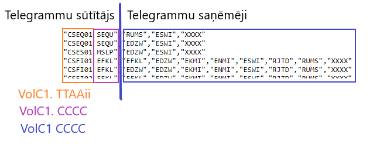

## Atlases uzdevumi

## 1.uzdevums:

Uzdevumam nepieciešamie dati ir failā:

https://drive.google.com/file/d/18bxURbIoI9zXxZvum_pWsMt4BcJo2NYp/view?%20usp=sharing

Datu failā ir apkopoti meteoroloģiskā parametra minūšu novērojumu dati par vienu gadu
trīs blakus esošajās stacijās (x1, x2 un x3)

| Datums.un.laiks | x1  | x2  | x3  |
|-----------------|:---:|-----|:---:|
| 01.01 00:00     | 2.9 | NA  | 2.7 |
| 01.01 00:01     | 2.2 | NA  | 2.7 |
| 01.01 00:02     | 2.0 | NA  | 2.5 |
| 01.01 00:03     | 2.7 | NA  | 2.4 |
| 01.01 00:04     | 2.6 | NA  | 2.0 |

1. Vizualizēt datus pa stacijām, izveidot kastu grafikus (boxplot).
2. Pārbaudīt datu kvalitāti un identificēt potenciālos izlēcējus (outlier) vai
   kļūdainas vērtības, savstarpēji salīdzinot datus starp stacijām. Izdarīt
   secinājumus. Ja nepieciešams, koriģēt datus.
3. Katrā stacijā aprēķināt mēneša vidējo vērtību, ņemot vērā nosacījumu, ka vidējā
   vērtība netiek rēķināta, ja iztrūkst vairāk par 20% vērtību mēneša laikā.
4. Modelēt datus ar sadalījumu – piemeklēt sadalījuma formas (shape) un mēroga
   (scale) parametrus. Piemeklēt tādu sadalījumu, kas Jūsuprāt labāk atspoguļotu
   datu uzvedību.

---
## 2.uzdevums:

Uzdevumam nepieciešamie dati ir sekojošos failos:

https://wis.wmo.int/operational-info/VolumeC1/VolC1.txt

https://wis.wmo.int/operational-info/GTS_routeing/ESWI/ESWIroca.txt

Fails VolC1.txt apraksta visu reģistrēto starptautisko telegrammu sarakstu, ko savstarpēji
pārsūta meteoroloģiskie dienesti.
Datu saturs ir aprakstīts faila pirmajā rindā.
Fails ESWIroca.txt apraksta konkrētu RTH (Regional Telecommunication Hub)
telegrammu apmaiņas shēmu starp meteo dienestiem. Tabula apraksta, kādu telegrammu,
kurš un kuram meteoroloģiskajam dienestam ir pārsūtījis. Katrs meteoroloģiskais dienests
var pārsūtīt savu telegrammu vairākiem datu saņēmējiem.

1. Veikt abu failu datu ielādi tiešā veidā ar programmēšanas valodas palīdzību.
   Pievienot kodu un tā aprakstu, kādā veidā tika ielādēta nepieciešamā
   informācija.
2. WMO datu analīze un vizualizācija. Failā ESWIroca.txt atrast, kādas
   telegrammas saņem LVĢMC. LVĢMC abreviatūra ir UMRR (CCCC). Apkopot
   sekojošo informāciju:
   a. no kurām valstīm un cik daudz telegrammu ir saņemtas;
   b. veikt telpisku datu vizualizāciju.
3. Failam VolC1.txt katru rindu saglabāt kā savu .txt failu, izveidot non-sql failu
   struktūru. Uzdevuma atskaitē pievienot ciļņu struktūru ar list.files vai
   alternatīvām komandām. Failu nosaukumus parādīt zem sekojošiem CCCC:
   UMRR, ESWI, EEMH.

   - a) Ciļņu struktūrai jāatbilst paraugam:
   %Region%/%RTH%/%Country%/%CCCC%

   - b) Failu nosaukumiem jāatbilst paraugam:
   %Country%_%TTAAii%_%CCCC%_TimeGroup%.txt
---
## 3.uzdevums:
Uzdevumam nepieciešamie dati ir failā:

https://drive.google.com/file/d/1BmxOUfiEt6XpCImKEO0xGphBImKtV9U5/view

Datu failā ir apkopoti prognožu dati Baltijas teritorijai no vairākiem meteoroloģiskajiem
parametriem. Fails ir saglabāts .nc formātā (netcdf).
1. Veikt parametra ssr (summārā saules radiācija) vizualizāciju Latvijas apgabalam
   pirmajai, piecpadsmitajai un 22. stundai.
2. No faila izvilkt radiācijas datus (ssr) sekojošām pilsētām: Liepāja, Alūksne un
   Dagda. Veidot laikrindu, attēlojot uz grafika stundu vidējās radiācijas vērtības,
   konvertējot mērvienības uz W/m2