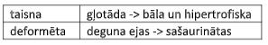

Uzdevums programmētājam

1) Pielietojamās tehnoloģijas: underscore+backbone+jquery+slim framework rest steks, IE11 atbalsts.
   (šablonos nedrīkst būt PHP loģikas)
2) Sameklēt pacientu datu bāzē pēc pacienta personas koda. Uz personas koda ievadīšanas aili bāzes
   pārbaudes (tikai cipari un “-“ zīme, ne vairāk ka 12 simboli). Meklēšanai neizmantot pogu, bet ievadot
   ciparus pēc 3.cipara parādīt 10 pirmos ierakstus no datu bāzes, kam ir tādi cipari. Meklēšana nenotiek pēc
   katra cipara ievadīšanas, tikai ja notiek 2 sekunžu pauze. Ideāli izmantojot steku no 1.punkta.
3) Nepieciešams izveidot formu ārstam aizpildīšanai. Nepieciešamie laukumi (laukumiem jābūt ar ciparu
   nosaukumiem un saņemot datus sūtīt kā objektu JSON):

Formu vajag atvērt PopUp logā un pirmā daļa līdz punktam Ārējā forma ieskaitot. PopUp divas pogas
Atcelt un Turpināt. Atcelt taisa ciet PopUp, Turpināt iedod datus otram PopUp logam (parēja visa

informācija). Otrā PopUp atkarīgi no Ārējā forma atzīmēšanas saņemt no DB informāciju un atzīmēt
automātiski:

Vajag parādīt iemaņas strādāt ar Deffered notikumiem (ka pec vienas forma daļas aizpildišanas dati jau
saglabajas datubaze, un talak tikai papildinajas). Ar pogu Saglabāt informācija tiek saglabāta datu bāzē
pievienojot laiku, kad darbība tika izdarīta (datuma formāts: 2020-10-10T10:10:10Z). Otras formas
saglabāšanu dabu bāzē sadalīt uz trim SQL pieprasījumiem.
4) Pēc pacienta meklēšanas nospiežot pogu, ārstam jāredz sarakstu ar ierakstiem datu bāzē. Kārtošana pēc
   pievienošanas laikā DESC, atspoguļojot laiku formātā dd.mm.yyyy (nedrīkst izmantot explode). Divas
   pogas Delete. Ar vienu ieraksts dzēšas loģiski (tikai nav redzams, bet paliek DB). Ar otro arī no DB.
   Abos gadījumos ierakstam vajag pazust no ekrāna. 
   Nospiežot uz ierakstu var atvert pacienta datus, un aplukot tos (popup vai kada cita varianta).