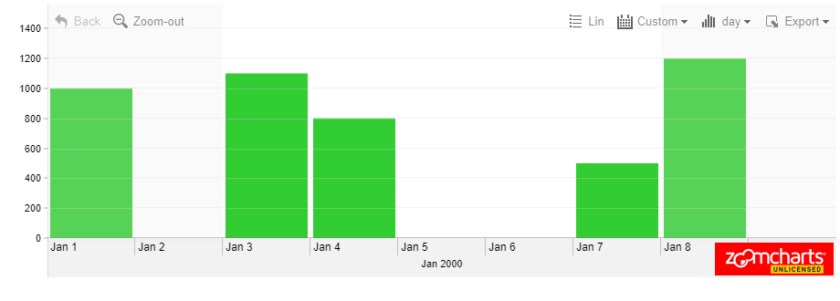

# ZoomCharts live-coding interview task

The interviewer presents you with the task in the online IDE service [JSFiddle](https://jsfiddle.net/). Approximately 40 minutes are given for the task. Searching in *Google* and asking questions is permitted.

## JavaScript + jQuery 1.12.4

```javascript
// Task:

// - Provide exactly 1 data point for every day from January 1, 2000 (UTC) to January 1, 2010 (UTC) (including Jan 1, 2000, but excluding Jan 1, 2010)

// - The value at each data point should equal the current year (UTC) multiplied by the current day of the month (UTC)

// For example:
// Jan 2 2000 should have value 4000,
// May 3 2001 should have value 6003,
// Feb 1 2002 should have value 2002,
// etc.

const chart = new ZoomCharts.TimeChart({
  container: "demo",
  data: {
    units: ["d"],

    // All coding of interest for this task takes place inside this function
    dataFunction: function(from, to, step, success, fail) {

      // These variables control the time range the chart displays
      const startTime = Date.UTC(2000, 0, 1);
      const endTime = Date.UTC(2000, 0, 10);

      // This variable is used to display some of the initial values
      // Feel free to modify or remove it
      const diff = Date.UTC(2000, 0, 4) - startTime;

      // Values in this array end up shown in the chart
      // Format is: [timestampDataIsShownAt, valueShownAtTime]
      const res = [];

      res.push([startTime, 1000]);
      res.push([Date.UTC(2000, 0, 3), 1100]);
      res.push([startTime + diff, 800]);
      res.push([startTime + 2 * diff, 500]);
      res.push([Date.UTC(2000, 0, 8), 1200]);

      // This call can be left alone for this task
      success({
        unit: step,
        values: res,
        from: startTime,
        to: endTime,
        dataLimitFrom: startTime,
        dataLimitTo: endTime
      });
    }
  },
});
```

## HTML

```html
<script src="https://cdn.zoomcharts-cloud.com/1/latest/zoomcharts.js"></script>
<content>
    <div id="demo"></div>
</content>
```

## Chart
