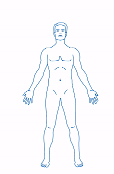

Darba uzdevums:

Izveidot webisku risinājumu, kuru izsauc ar webformas pogas klikšķi, kur atveras attēls ar cilvēka avataru.

1. Avatarā jāvar iezīmēt (iekrāsot) izvēlētus avatara apgabalus. Piemēram iepriekš sagatavotas un iezīmētas daļas.

2. Jāvar saglabāt iezīmēto avataru kā bildi.

3. Jābūt iespējai labot (no jauna selektēt/deselektēt zonas) avataru un saglabāt kā jaunu bildi.

4. Avatara piemērs ir pielikumā. Šeit nav izveidotas zonas, bet tās katrs darba veicējs var pats izveidot. Avatarā jābūt vismaz 10 zonām šajā darba uzdevumā.

